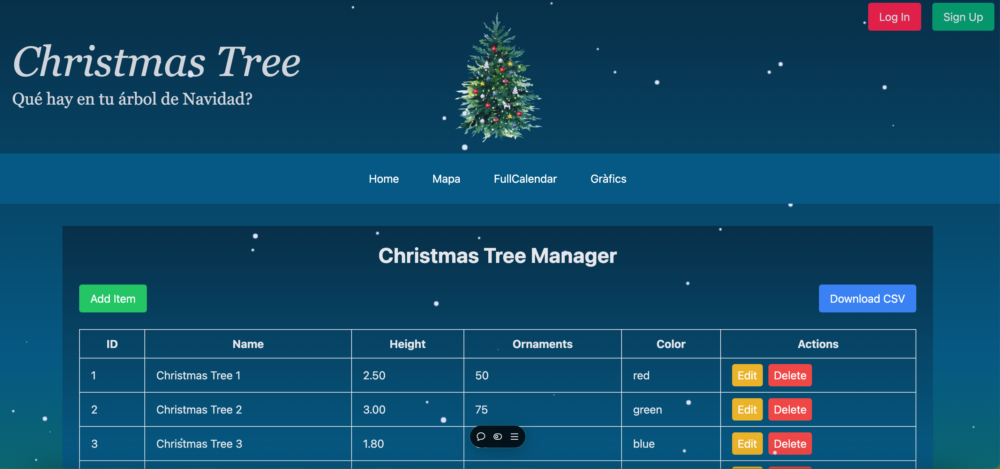
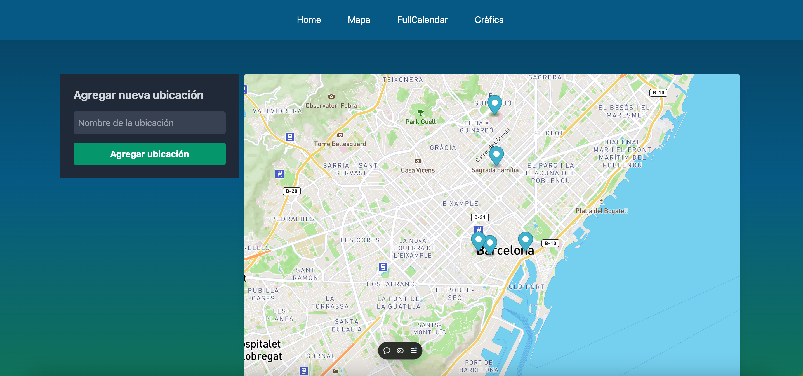
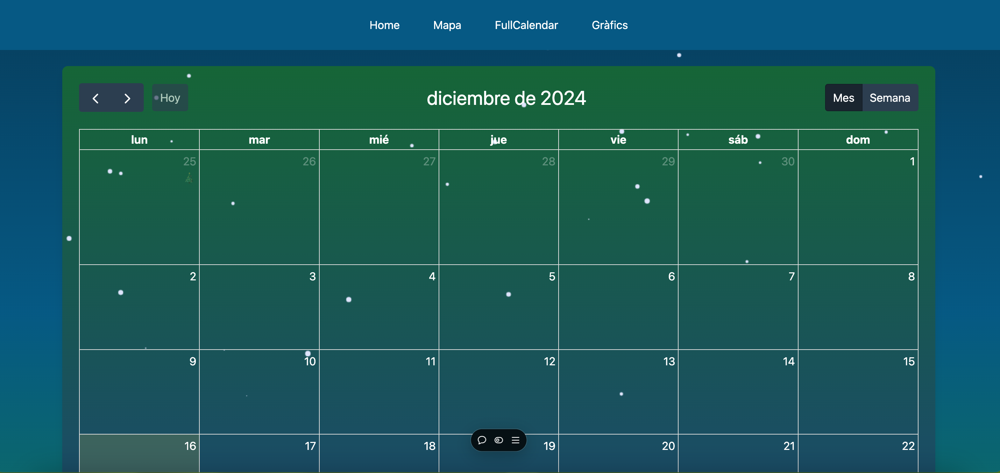
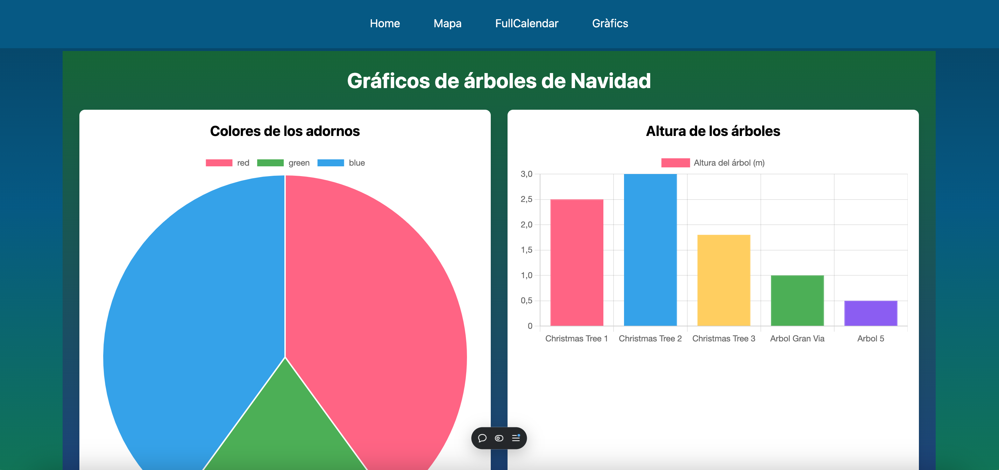

# Christmas Tree - Proyecto Web

## Descripción

Este proyecto es una aplicación web para gestionar un árbol de Navidad virtual. Los usuarios pueden agregar información sobre su árbol, como la altura, las ubicaciones de las decoraciones y sus colores, así como visualizar esta información en gráficos y en un mapa interactivo.






## Funcionalidades

- **Mapa**: Visualiza las ubicaciones de los árboles de Navidad en un mapa interactivo usando Mapbox.
- **Gráficos**: Muestra gráficos sobre la altura de los árboles y los colores de las decoraciones utilizando Chart.js.
- **CRUD de Ubicaciones**: Permite agregar, ver y eliminar ubicaciones de los árboles de Navidad.
- **Conexión a Base de Datos**: Utiliza MySQL para almacenar las ubicaciones y datos relacionados con los árboles.

## Tecnologías Usadas

- **Frontend**: 
  - React
  - Vite
  - TypeScript
  - Tailwind CSS
  - Mapbox GL
  - Chart.js

- **Backend**:
  - Node.js
  - Express.js
  - MySQL

- **Despliegue**:
  - Vercel
  - Railway

## Instalación

1. **Clona el repositorio**:

   ```bash
   git clone https://github.com/Aleksei-Che/s8-christmas-tree
  ```

2. **Instala las dependencias**
En la raíz del proyecto, ejecuta:

```bash
npm install
```
3. **Configura el archivo .env:**

Crea un archivo .env en la raíz del proyecto y añade las siguientes variables de entorno:

```bash
MYSQLHOST=your-mysql-host
MYSQLDATABASE=your-database-name
MYSQLUSER=your-database-username
MYSQLPASSWORD=your-database-password
MYSQLPORT=3306
```
4. **Ejecuta el servidor en desarrollo:**

Ejecuta el siguiente comando para iniciar el servidor de desarrollo:
```bash
npm run dev
```
Abre http://localhost:5173 en tu navegador para ver la aplicación en acción.
## Despliegue en Producción

### Vercel

Para desplegar la aplicación en Vercel:

1. Asegúrate de tener la configuración adecuada en el archivo `vercel.json`.

2. En la terminal, navega a la raíz del proyecto y ejecuta el siguiente comando para desplegar en Vercel:

   ```bash
   vercel --prod
   ```
### Railway

1. Crea un proyecto en Railway y conecta tu base de datos MySQL.

2. Sigue las instrucciones de Railway para conectar tu base de datos y variables de entorno.

3. Despliega el proyecto con el siguiente comando:

```bash
railway up
```
API
La API del backend expone los siguientes endpoints:

GET /locations: Obtiene todas las ubicaciones.
POST /locations: Crea una nueva ubicación.
DELETE /locations/:id: Elimina una ubicación.

## API

La API del backend expone los siguientes endpoints:

- `GET /locations`: Obtiene todas las ubicaciones.
- `POST /locations`: Crea una nueva ubicación.
- `DELETE /locations/:id`: Elimina una ubicación.

## Contribuciones

Si deseas contribuir al proyecto, por favor, sigue estos pasos:

1. Haz un fork del repositorio.
2. Crea una nueva rama para tus cambios.
3. Realiza un commit con tus cambios.
4. Haz un pull request con una descripción clara de los cambios realizados.

### Licencia

Este proyecto está bajo la licencia MIT. Consulta el archivo LICENSE para más detalles.
